# IEEE-754 Binary-32 floating-point operation
## Overview
This Python project implements IEEE-754 binary-32 floating point arithmetic operations, specifically focusing on addition. The operation allows two rounding formats - with Guard, Round, Sticky (GRS) and without (GRS) which uses Round To Nearest, Ties to Even (RTN-TE) to round to the required number of bits for the operands. It has support for positive and negative binary values, a maximum of up to 24 digits, and exponent values ranging from -126 to 127. The step-by-step output is shown in normalized 1.f binary format, with an additional option to export said steps as a text file.

## Features
- Expected Input: Positive and Negative binary inputs
- Exponent Constraints: -126 to 127 exponent values
- Digit Constraints: 24 digits
- Operations: Addition and Subtraction (via negative inputs)
- Rounding Modes: RTNE and GRS rounding, Normalization
- Input Checking
- Step-by-step output displayed in the GUI
- Option for file export as a .txt file

## Usage
### Running the code
1. Download the GitHub files to your local machine.
2. Open the file IEEE_754_Binary_32_operation.py
3. Compile and run the Python file (IEEE_754_Binary_32_operation.py)
### Running the .exe
1. Download IEEE_754_Binary_32_operation.exe
2. Double click and run it (may take a moment to load)
Note: The automated tests will also run and be shown on the CLI.

### GUI Input
The program will ask the user for two floating point binary inputs and their exponents. 
Following this they will be prompted to choose which rounding mode they would like to use.
Then lastly they need to input the number of digits that is going to be used for the operation.

## Test Cases and Sample Outputs
### Both Positive
This test case shows two positive inputs, added with GRS on the left, and without GRS (hence, using RTNTE) on the right.

| With GRS | Without GRS |
| ---------| ------------|
| 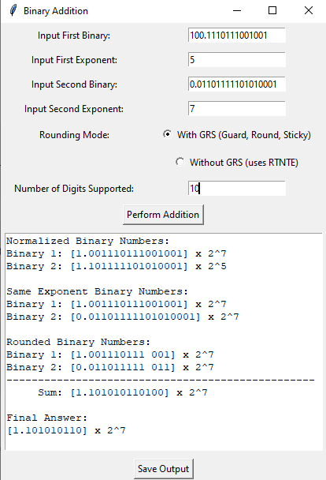 | 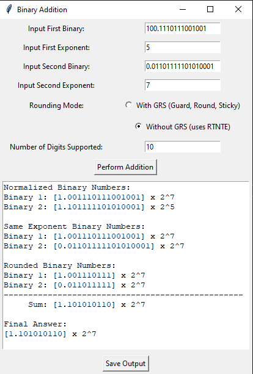 |

### One Positive, One Negative
These cases show adding with a positive and a negative input, again with GRS on the left, and without GRS on the right.

| With GRS | Without GRS |
| ---------| ------------|
|1st Input is positive, 2nd Input is negative.| |
| 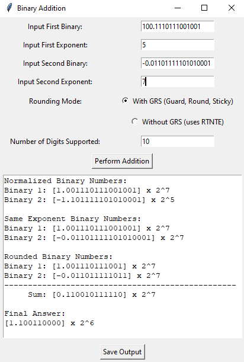 | 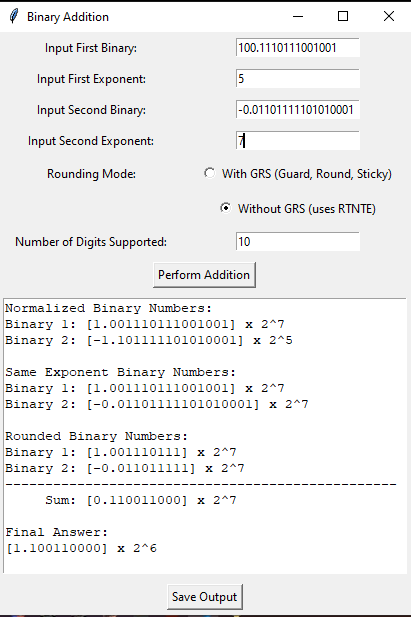 |
|1st Input is negative, while the 2nd is positive.| |
| 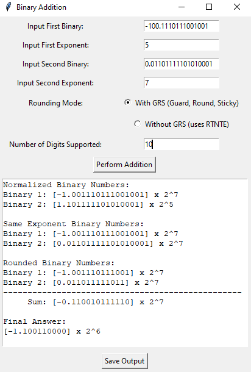 | 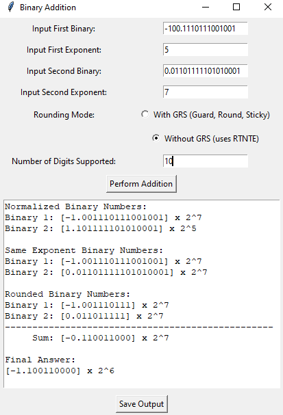 |

### Both Negative
This test case shows two negative inputs, added with GRS on the left, and without GRS (hence, using RTNTE) on the right.

| With GRS | Without GRS |
| ---------| ------------|
| 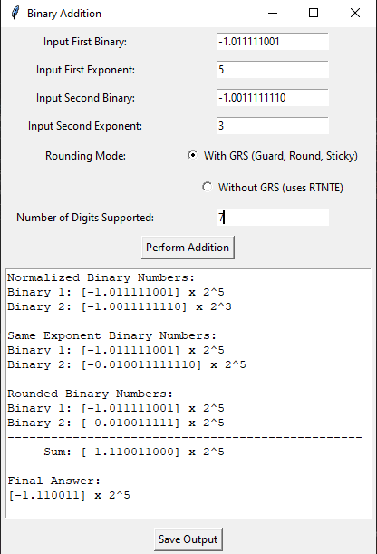 | 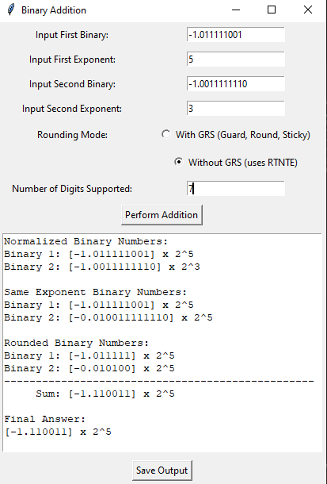 |

### 0 - inputs
This test case shows the program would run with zero-value inputs.

| With GRS | Without GRS |
| ---------| ------------|
| 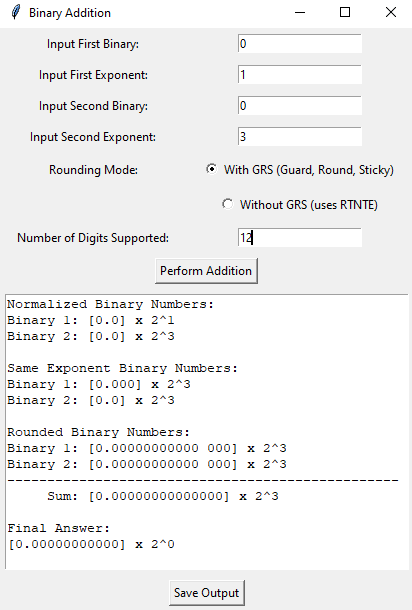 | 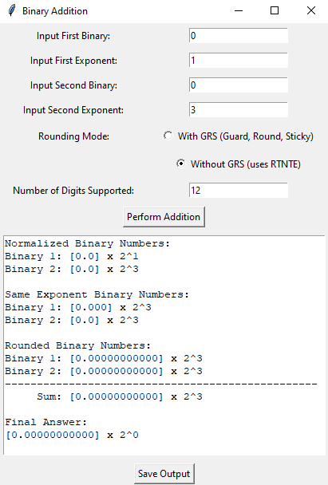 |

### Some Input Checking
There are also several simple forms of input checking available in the program. Some of these include checking that all fields have a value, the values are within the range, and that the values make sense (ie, binary is only 1's and 0's). Some examples of these error-checking outputs are shown below.

| Sample Input Checks | | |
|------------------------|------------------------|------------------------|
|Missing Input | Incorrect Input | Out of Range/Not Supported |
| 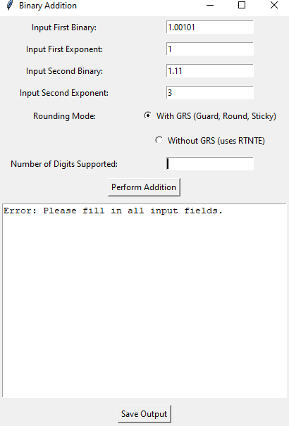 | 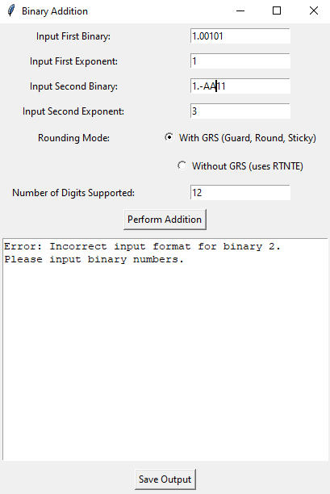 | 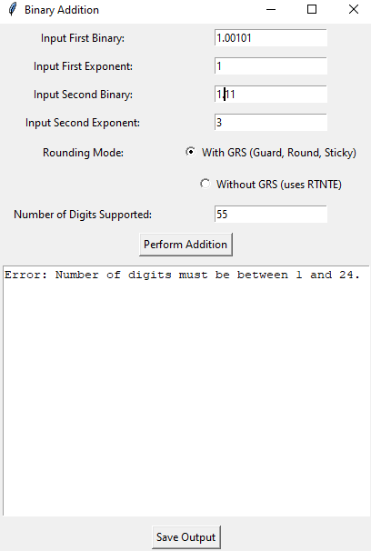 |

### Output to .txt file
Finally, the following images shows a sample of saving the output to a text file, then showing the file's contents to be the same as the content displayed in the GUI.

| Outputting to text | | | |
|------------------------|------------------------|------------------------|------------------------|
|Initial Output | Upon clicking 'Save Output' | Prompt on successful save | Viewing content of the saved file |
| 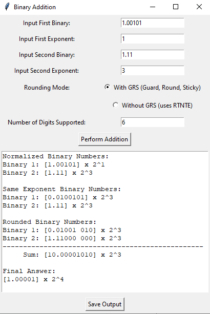 | 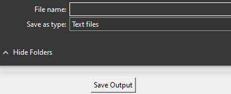 | 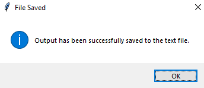 | 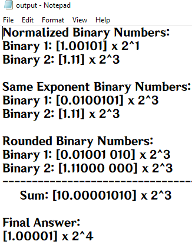 |

## Problems Encountered
There were several problems that were encountered by the group while creating this simulation project. One was the time constraints due to requirements in other subjects, but as for the coding itself, there were issues particularly in creating and implementing the normalization, rounding, single digit support, and negative inputs (and consequently, subtraction). The last of the set was particularly troublesome because the entire project was initially implemented to *not* allow negative numbers.
### Normalization
Creating a correct and working normalization function is an important step in creating the project. The initial implementation correctly shifted cases such as `1.xxx, 1xxx.xxx, and so on` (where x is 0 or 1), based on a specific inputted shifting value. The issue came with denormalized binary cases like `0.1, 0.0001, 0.xxx1, and 00.0xxx1`. After investigating, it was found that the original implementation handled the 'integer' part and 'floating' part incorrectly, shifting the cases to values like `0000.1`. Given this, the code was changed to first check the two parts of the binary input - to see if the integer part had a '1', then slowly shift the binary point and exponent until it is properly normalized.  
### Rounding
Implementing the Round to Nearest, Ties to Even was initially implemented incorrectly due to misremembering how RTNTE works. The solution was relatively straight forward - double-checking the slides and reviewing the methodology, and finally implementing it in code.
### Single Digit Support
Due to the odd nature of Python addition and binary splitting, the single digit support (ie, Digits Supported = 1) became a headache in the project. 
- First is Python truncates excess 0's, ie adding `1.0 + 1.0` would return `10` instead of `10.0`, which technically is not wrong, but in terms of the scope of the project, it is indeed incorrect. Thus, to conform to the format discussed in class, the extra 0's had to be manually checked and added to the binary result. 
- The second issue ties in with the first since the `.split(.)` function works only if the binary point is present in the value. This means that values like `10, 1, and 0` would cause errors. Guard clauses that would 'fix' the value to have a binary point were added, but another issue that came as a result was the final sum printing `0.0` instead of just `0` for single digit support cases. After some trial and error, the final solution was to just note the length (supported digits), then manually manipulate the resulting integer sum to be the correct format. 
 - To be more specific, the earlier case of `0.0` (which is incorrect) would instead print `0` (correct) if only 1 digit is supported.
### Negative Inputs & Subtraction
As stated earlier, the initial implementation did not account for negative binary numbers, as we thought that project primarily focused on addition. However, after realizing the need to handle negative inputs for a more comprehensive simulation, the code underwent significant revisions. Then, main challenge was adapting the existing codebase to accommodate negative binary numbers and perform subtraction operations. This involved reworking the normalization, rounding, and addition algorithms to handle negative inputs correctly. 
The solution was really to just initially note whether or not the function parameter input (for functions for normalizing and rounding) was negative or not. After, a flag would be set, the negative sign would be cut, then the function would proceed as if the input value were positive. After, the negative sign would be added back to the value. The adding function was also revised to use Python's `Decimal`, while also adding the functionality for subtraction (again, occurs when at least one of the inputs is negative). 
### Overall Checking
This isn't actually a problem, but a solution we used to verify our output was creating 'automated tests' to verify that the bugs and incorrect outputs that were occuring were slowly being fixed. An issue that often occurs when coding is fixing a bug, only for another one to appear, hence the decision to make this automation. This idea primarily came from the STSWENG course that we are currently taking, and it really did make checking our project much easier, allowing us to find more edge cases (if any) and create a project that we are relatively satisfied with - output wise.

## Authors
### S15 Group 1
- Lim, Lanz
- Ong, Camron
- Tan, Tyler
- Wang, Jeremy